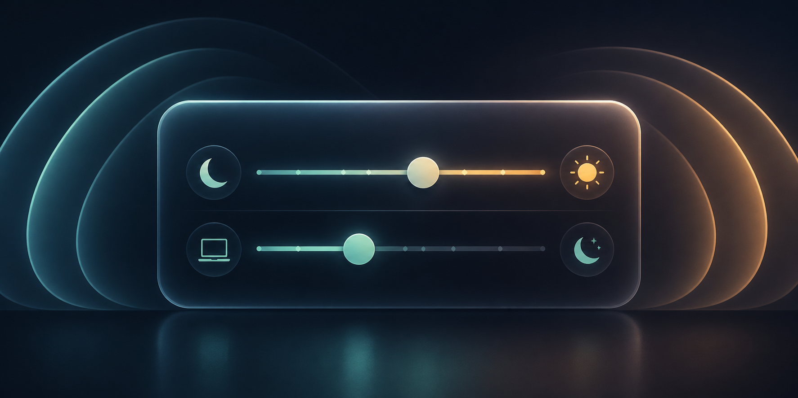

# Power Management

  



Power Management is an open-source macOS preference pane for editing common `pmset` idle timers without Terminal. It keeps display sleep and system sleep separate, so a Mac can turn its screen off while long-running work continues.

It can also switch the screen saver delay automatically when AC power is connected or disconnected. The background monitor is a login LaunchAgent that sleeps on an IOKit power-source notification; it does not poll.

## Install

Install the released preference pane with Homebrew:

```sh
brew tap GeneralD/tap
brew install --cask pmset-pane
```

The initial release is ad-hoc signed while Developer ID notarization is pending. The cask removes its download quarantine after installation so System Settings can load the preference pane.

To build from source instead:

```sh
git clone https://github.com/GeneralD/pmset-pane.git
cd pmset-pane
./scripts/build-prefpane.sh
open dist/PMSetPane.prefPane
```

## Use

Open **System Settings**, choose **PMSet Pane**, then select **Battery** or **Power Adapter**. The pane reads the current `pmset` values and requests administrator authentication only when applying a change.

To run an AI agent while away from the Mac:

1. Set the screen saver in System Settings to your preferred delay.
2. Set **Turn display off after** to a later delay.
3. Set **Put computer to sleep after** to **Never**.

For separate screen saver delays, select **Battery** or **Power Adapter**, set **Start screen saver after** for that power source, then click **Apply Changes**. Repeat for the other power source. The monitor starts at login and updates the screen saver delay immediately whenever the power source changes.

The Screen Saver, Display Off, and Computer Sleep sliders preserve their order. Moving a slider pushes the related timers forward or backward as needed. Disk Sleep is an independent slider.

The pane refuses an invalid timer ordering that can cause macOS to warn that display sleep occurs after system sleep.

## Build and test

```sh
swift test
./scripts/build-prefpane.sh
```

## Compatibility

macOS 13 or later. This is a legacy `.prefPane` bundle, which macOS displays as a third-party pane in System Settings.

## License

MIT — see [LICENSE](LICENSE).
